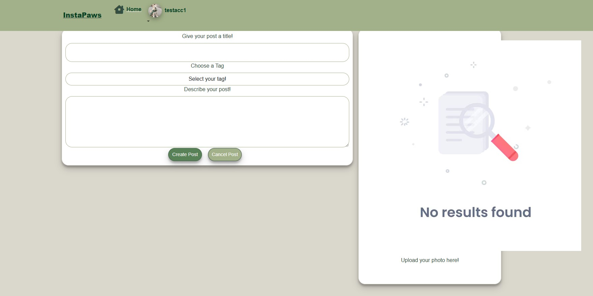

<h1 align="center">InstaPaws - Project Portfolio 5</h1>

## - By Bradley Hammond

### [View Live Website](https://instapaws-f3da7aad813f.herokuapp.com/)

## About

- InstaPaws is a community-driven web application designed for dog lovers to share their furry friends with the world. Similar to Instagram, InstaPaws allows users to post photos and engage with others through likes, comments, and follows—all centered around their beloved dogs.

- Whether you're showcasing your dog's latest adventure, connecting with fellow pet owners, or simply enjoying wholesome dog-related content, InstaPaws provides a welcoming platform for the dog-loving community to come together.

## Project Goals

- The goal of this project was to create a unique and engaging platform centered around dogs, putting a fun twist on a typical social media app. With InstaPaws, I wanted to combine interactive features, vibrant design elements, and a community-driven concept to create a space where dog lovers can connect, share, and celebrate their furry friends. My aim was to make the app feel welcoming, enjoyable, and refreshing for users, fostering a sense of belonging and joy within the dog-loving community.

## User Stories

- Please note the order of these got mixed up so the order does not go chronological order.

#### Navigation (Project Goal Covered: #1, #2, #6)
- As a new or returning user, I can see the login and sign-up buttons, allowing me to either access my existing account or create a new one
- As a user, I can access the homepage to understand the purpose and functionality of the site
- As a user, I can see the navigation bar at all times, providing easy access to navigate between pages for a seamless user experience

#### Authentication (Project Goal Covered: #1, #4, #5)
- As a new or returning user, I can see the login and sign-up buttons, allowing me to either access my existing account or create a new one
- As a returning user, I can log into my account to access all features available to logged-in users
- As a new or returning user, I can create an account to access all features of the website that require login

#### Posts (Project Goal Covered: #7, #8, #9, #10, #11)
- As a user, I can share content on the website, including updates on my furry friend
- As a user, I can view detailed information about a specific post, allowing me to see all content related to the post
- As a user, I can use the search bar to filter and find the content I want to see
- As a user, I can like a post to express my opinion and provide feedback on someone else's content
- As a user, I can view the tags associated with a post to determine its relevance to my interests

#### Main feed page (Project Goal Covered: #12, #13)
- As a user, I can view other profiles to stay updated on their followers, followings, and posts
- As a user, I can scroll the website continuously, allowing me to view all posts seamlessly without interruption

#### Profile Page (Project Goal Covered: #3, #12)
- As a user I can upload a profile picture so that I can style my profile to make me recognizable
- As a user I can change my password so that I can keep my profile secure

## Design Choices

### Colour Scheme

- For the design of InstaPaws, I aimed to follow a cohesive and visually appealing color palette to create a vibrant and engaging user experience. The primary colors were selected to reflect the playful and community-driven theme of the app.

- While I adhered to this color palette as closely as possible, there were instances where adjustments were necessary. In particular, some colors had to be darkened to ensure sufficient contrast for accessibility. This was done to meet accessibility standards and improve the Lighthouse score, ensuring the platform is user-friendly for everyone.

- By prioritizing accessibility, I balanced aesthetics with functionality, creating a design that is both visually appealing and inclusive.

### Animations

When building this website, I wanted to keep the experience engaging and fun, so I added unique animations to enhance user interaction. Here are the animations implemented:
- Navbar Fade-In: When loading the page, the navbar smoothly fades in from top to bottom, adding a playful touch for the user.
- Icon Animations: Hovering over navbar icons triggers a shake animation, while smaller icons have a gentle shake, creating an interactive and intuitive navigation experience.
- Profile Picture Animation: Hovering over profile pictures applies a gentle shake effect, providing a clear visual cue to the user.
- "Most Followed" Section Tilt: A slight tilt animation is applied to the "Most Followed" section, highlighting its significance and drawing user attention.
- "Search by Post Tags" Bounce: Tags in the "Search by Post Tags" section have a subtle bounce-right animation to encourage users to explore tag-based search functionality.
- Scroll-to-Top Button: The scroll-to-top button bounces gently up and down, providing a visual cue for navigation. It fades in only after the user scrolls down the page.
- Follow/Unfollow Button Bounce: On the profile page, the "Follow" and "Unfollow" buttons have a slight bounce animation, indicating their functionality to the user.
- Button Hover Effects: Buttons across the website feature a gentle shake animation when hovered over, enhancing interactivity and making the user experience more engaging.

### Wireframes

- I used [Wireframes.cc ](https://wireframe.cc/) as my preferred wireframing tool for designing the website due to its simplicity and user-friendly interface. While the final design of the website may differ slightly from the wireframes, they served as foundational guidelines to visualize the structure and layout I aimed to achieve. Wireframes were created for both mobile and desktop views to ensure a responsive and consistent user experience across devices.

#### Homepage

- Homepage Desktop Wireframe - [View](/docs/readme/HomepageDesktop.jpg)
- Homepage Mobile Wireframe - [View](/docs/readme//HomepageMobile.jpg)

#### Login/Signup

- Login / Signup page Desktop Wireframe - [View](/docs/readme/LoginSignupDesktop.jpg)
- Login / Signup page Mobile Wireframe - [View](/docs/readme/LoginSignupMobile.jpg)

#### Home Feed

- Home Feed Desktop Wireframe - [View](/docs/readme/MainPageDesktop.jpg)
- Home Feed Mobile Wireframe - [View](/docs/readme/MainPageMobile.jpg)

#### Post Detail

- Post Detail Desktop Wireframe - [View](/docs/readme/PostDetailDesktop.jpg)
- Post Detail Mobile Wireframe - [View](/docs/readme/PostDetailMobile.jpg)

#### Create Post

- Create Post Desktop Wireframe - [View](/docs/readme/CreatePostDesktop.jpg)
- Create Post Mobile Wireframe - [View](/docs/readme/CreatePostMobile.jpg)

#### Profile Detail

- Profile Detail Desktop Wireframe - [View](/docs/readme/ProfileDetailsDesktop.jpg)
- Profile Detail Mobile Wireframe - [View](/docs/readme/ProfileDetailMobile.jpg)

#### Edit Profile

- Edit Profile Desktop Wireframe - [View](/docs/readme/EditProfileDesktop.jpg)
- Edit Profile Mobile Wireframe - [View](/docs/readme/EditProfileMobile.jpg)

#### Edit Password

- Edit Password Desktop Wireframe - [View](/docs/readme/EditPasswordDesktop.jpg)
- Edit Password Mobile Wireframe - [View](/docs/readme/EditPasswordMobile.jpg)

## Technologies Used

### Languages

- React 18.3.1
- Javascript
- HTML
- CSS

### Libraries, frameworks and dependencies

- **Axios:** This was used for promise-based HTTP requests.  
  **Justification:** I utilized Axios in the front end to send various types of requests to my API for sending and retrieving data for users to view. It also helped prevent Cross-Origin Resource Sharing (CORS) errors by enabling controlled access to data on my API's domain.

- **JSON Web Token (JWT) Library:** This library was used for decoding JSON Web Tokens.  
  **Justification:** I implemented JWT to prevent unauthenticated users from making unnecessary network requests to refresh their access token. This enabled me to set and remove authentication tokens, ensuring the site recognized a user's login status. If logged out, no authentication token was stored in cookies.

- **React:** This is a JavaScript library for building user interfaces.  
  **Justification:** React allowed me to create multiple encapsulated components that manage their own state. It was particularly beneficial for automatically updating the user interface when data changed.

- **React Bootstrap:** This library was used to import various pre-designed components that are mobile-responsive and come with preset classes and styles.  
  **Justification:** It significantly accelerated the development process by allowing me to focus on functionality rather than spending excessive time on HTML styling.

- **React Router:** This library was used for dynamic routing.  
  **Justification:** It allowed me to control the content displayed based on the URL being accessed by the user. This was essential for building all the pages of my site and defining functional route paths.

- **React Transition Group:** This library was used to implement CSS transitions.  
  **Justification:** It enabled smooth fade-in effects for components on my website, contributing to the visually engaging and dynamic look I aimed for.

- **React Infinite Scroll:** This library played a crucial role in keeping users engaged.  
  **Justification:** It allowed content (posts and comments) to load automatically as users scrolled toward the bottom of the page, ensuring that content was continuously available without disrupting the user experience.

### Tools & Programs

- [Cloudinary](https://cloudinary.com/) to store static files
- [Coolors](https://coolors.co/?home) was used to create the color scheme palette
- [Chrome Developer Tools](https://developers.google.com/web/tools/chrome-devtools/) was used for debugging of the code and checking site for responsiveness
- [GitHub](https://github.com/) was used as a remote repository to store project code
- [Font Awesome](https://fontawesome.com/) - icons from Font Awesome were used on my website
- [React Icons](https://react-icons.github.io/react-icons/search) - icons from react-icons were used on my website
- [React Spinners](https://www.davidhu.io/react-spinners/) - spinner came from this website and I changed the coloir
- [React Spinners](https://www.davidhu.io/react-spinners/) - spinner came from this website and I changed the coloir
- [Visual Studio Code](https://code.visualstudio.com/) - Was my chosen workspace to code this project
- [Heroku](https://dashboard.heroku.com/apps) was used to deploy my code live
- [ESLint](https://eslint.org/) used to validate JSX code
- [WC3 Validator](https://validator.w3.org/) was used to validate my HTML
- [Lighthouse Tools](https://developers.google.com/web/tools/lighthouse/) used to validate performance, accessibility, best practices and SEO of my website
- [Jigsaw W3 Validator](https://jigsaw.w3.org/css-validator/) was used to validate my CSS

## Front-End

### React

React is a widely-used JavaScript library designed for building user interfaces. Created by Facebook, React enables developers to construct reusable UI components and manage their state, simplifying the creation of complex, dynamic, and interactive web applications. React’s virtual DOM ensures efficient updates and rendering of components, leading to fast and responsive applications. With its large, active community, extensive ecosystem of tools and libraries, and emphasis on declarative, component-based programming, React has become a top choice for modern web application development.

#### Why I Used React in My Project

1. **Reusability:** React’s component-based structure facilitates the reuse of code, streamlining the development process and saving time.

2. **Performance:** The virtual DOM allows React to efficiently update and render components, ensuring a high-performance user experience.

3. **Community Support:** React’s large and active community provides access to numerous tools, libraries, and solutions, keeping development current and efficient.

4. **Declarative Programming:** React’s declarative approach simplifies code comprehension and debugging, reducing the risk of bugs.

5. **Scalability:** React’s architecture scales well for projects of all sizes, from small applications to large, complex systems.

This project leveraged React’s strengths, particularly the ability to render multiple components simultaneously across the application.

#### Components Created for My Application

To meet the project requirements, I developed several reusable and unique React components:

- **`<Asset />`**  
  This component dynamically displayed assets based on the props provided. Props included:  
  - A loading spinner icon from `react-spinners` for when content was loading.  
  - An image with a `src` attribute.  
  - A message rendered within a paragraph tag.

- **`<Avatar />`**  
  A reusable component for rendering user profile pictures (avatars). It accepted a `src` prop, allowing the avatar image to be updated (e.g., when a user changed their profile picture). This component was used in multiple pages, such as posts, the profile page, and the `<NavBar />` component.

- **`<DropdownMenu />`**  
  This component rendered dropdown menus for editing or deleting user content. It was implemented across multiple pages, including the post page (for editing user posts), profile page (for editing profile data), and comments sections.

- **`<NavBar />`**  
  A reusable component displayed on every page of the application. The content within the navbar adjusted based on the user’s authentication status. For example:  
  - If a user was not logged in, it displayed icons for login/signup.  
  - If logged in, it showed the avatar component and a dropdown menu for logging out or accessing the user’s profile.

- **`<HomePage />`**  
  A unique component that rendered the homepage for unauthenticated users. It displayed login/signup buttons to encourage user engagement.

- **`<PageNotFound />`**  
  A unique component that rendered a "Page Not Found" message and image for 404 errors. It also included a "Go Back" button, which used `history.goBack()` to navigate the user back to their previous page.

- **`<ScrollToTopButton />`**  
  A reusable component that displayed a "scroll to top" button at the bottom-right of the screen when the user scrolled beyond a certain point. This enhanced usability by allowing users to quickly return to the top of the page to access the search functionality or tag filters.

- **`<Toolbar />`**  
  A reusable component displaying icons for creating posts, viewing liked posts, and accessing the user’s feed (posts from followed users). This component was prominently used throughout the application.

Each of these components was carefully designed to maximize reusability and contribute to a seamless user experience.

## Back-End API

### Django REST Framework

The backend API for this front-end application was developed using the Django REST Framework. You can view the details of the backend repository [here](https://github.com/Brad-Hammond/InstaPaws-API).

# Application Features and Screenshots

### Home Page (Logged Out)
- **Website Overview:**  
  A brief description of the website’s purpose, along with links to the log in and sign-up forms.

- **NavBar Links:**  
  The NavBar includes direct links to the log in and sign-up forms for easy navigation.

- **Social Media Links:**  
  Social media icons are displayed at the bottom of the page. Clicking on them opens the respective links in a new tab.

Project Feature Screenshot

### NavBar
- **Displayed on All Pages:** The NavBar is consistently visible across all pages of the application.
- **Logged-Out View:**  
  - Users see buttons for "Home," "Log In," and "Sign Up."
- **Logged-In View:**  
  - Users see buttons for "Home" and their "Profile Name."  
  - Clicking the profile name opens a dropdown menu with options to view "My Profile" or "Log Out."
- **"Instapaws" Title:**  
  - Always displayed in the NavBar and acts as a clickable link that redirects users to the home page.
- **Responsive Design:**  
  - On mobile screens, the NavBar changes to a dropdown menu format, containing all options for improved usability.

Project Feature Screenshot

### Sign Up Form
- **Account Creation:**  
  Enables new users to create an account by filling out the required details in the form.

- **Validation Requirements:**  
  - Users must provide a valid, unique username that is not already taken.  
  - Password and confirm password fields must match to proceed.

- **Unique Usernames:**  
  Usernames are required to be unique; duplicate usernames cannot be created.

- **Redirection After Sign-Up:**  
  Upon successful completion of the sign-up form, users are redirected to the login page.

Project Feature Screenshot

### Log In Form
- **User Authentication:**  
  Allows existing users with registered accounts to log in using their credentials.

- **Account Validation:**  
  The account must be valid and already exist in the system.

- **Password Verification:**  
  The password entered must match the username’s associated password.

- **Error Handling:**  
  Displays error messages if incorrect login details are provided.

- **Redirection After Login:**  
  Once successfully logged in, the user is redirected to the general posts page.

Project Feature Screenshot

### General Posts Page
- **Home Page for Logged-In Users:**  
  This page serves as the default landing page for users after logging in.

- **Page Content:**  
  - A toolbar with options for "My Hearts," "My Feed," and "Create Post."  
  - A section displaying "Most Followed Users."  
  - A tag selection area located on the right-hand side.

- **Post Display:**  
  - Displays all created posts, filtered by creation date, with the most recent posts shown first.  
  - When no search is specified, all posts are displayed.

- **Search Functionality:**  
  A search bar is available to allow users to filter and specify the content they wish to see.

Project Feature Screenshot

### Post Creation and Edit Form
- **Form Fields:**  
  Includes an image upload, title input, tag selection, and a content input area.

- **Optional Text Content:**  
  Text content is not mandatory for post creation.

- **Post Sharing:**  
  Allows users to create posts with images and add them to their feed to share their furry friends.

- **Tagging for Specificity:**  
  The tag selection feature helps categorize posts, making it easier for users to find relevant content.

Project Feature Screenshot

### Post Page
- **Post Details:**  
  Displays specific details of a single post, including the title, image, content, and tags.

- **Page Content:**  
  - **Like Functionality:** Displays the number of likes and includes a like button for users to interact with.  
  - **Comment Functionality:** Displays the number of comments and includes a comment button to allow users to add their own comments.  
  - **Comment Section:** Shows all comments associated with the post.

Project Feature Screenshot

### Comments Section
- **Commenting Functionality:**  
  Allows users to leave comments on a post.

- **Page Content:**  
  - Displays the date and time (days and hours) when each comment was made.  
  - Provides options for users to edit or remove their own comments if they are the comment owner.

Project Feature Screenshot

### Hearts
- **Hearting a Post:**  
  Allows users to leave a heart on a post to show appreciation.

- **Visual Indicator:**  
  When a post is hearted, the heart icon changes from an outlined to a filled icon and turns red.

- **Restrictions:**  
  Users cannot heart their own posts.

- **"My Hearts" Section:**  
  Users can view all the posts they have previously hearted in the "My Hearts" section.

Project Feature Screenshot

### Profile Page / Profile Picture
- **User Information:**  
  Displays the user’s profile details, including the number of posts created, followers, and following.

- **Profile Management:**  
  Includes a dropdown menu to edit the profile and change the profile password.

- **User Bio:**  
  If the user has added a bio, it is displayed on this page.

- **Profile Picture:**  
  - Users are assigned a default profile picture upon creating a new profile.  
  - The profile picture is reused throughout the website, appearing in comments, the navbar, the profile page, posts, and the "Most Followed" section.

Project Feature Screenshot

### User Password Edit/Change Form
- User can edit their password and save it to make changes.

Project Feature Screenshot

### Infinite Scroll
- **Uninterrupted Content Stream:**  
  Displays all posts on the site, allowing users to scroll continuously without breaks in content.

- **Infinite Rendering:**  
  Both posts and comments are rendered infinitely as the user scrolls.

- **Loading Indicator:**  
  A spinner is displayed while posts or comments are loading.

### User Icons Toolbar
- **Followed Feed Access:**  
  Allows users to view posts from accounts they follow directly from the Toolbar.

- **Consistency:**  
  The Toolbar is displayed on all pages except form pages, ensuring a consistent user experience.

- **Hearted Posts Access:**  
  Enables users to view all posts they have previously hearted.

- **Post Creation:**  
  Provides users with the option to create new posts using the Toolbar.

Project Feature Screenshot

### Scroll To Top Button
- **Mobile-Friendly Design:**  
  Optimized for mobile devices, enabling users to quickly return to the top of the page for easy access to the Toolbar and other navigation options.

- **User Flow Preservation:**  
  Designed to enhance usability without disrupting the natural flow of the application.

- **Visual Prompt:**  
  Includes an animation to signal its functionality, providing a clear visual cue that it scrolls back to the top of the page.

Project Feature Screenshot

### Following and Unfollowing
- **Follow/Unfollow Functionality:**  
  Users can follow or unfollow any user, enabling them to include or exclude that user’s posts in their personalized feed.

- **Accessible Actions:**  
  This feature is available in both the "Most Followed" section and on individual profile pages.

Project Feature Screenshot

### Most Followed Users
- **Profile Visibility:**  
  Displays the most followed profiles on the page for users to view.

- **Follow/Unfollow Options:**  
  Follow and unfollow buttons are provided below the most popular profiles, enabling users to add or remove their content from their personal feed.

- **Page Accessibility:**  
  This feature is visible on all pages except form pages.

- **Layout Optimization:**  
  Shows a maximum of 5 most popular profiles at a time, ensuring a user-friendly layout even if many accounts exist.

- **Mobile-Friendly Design:**  
  Includes a scrollbar on mobile devices to shorten the displayed content and provide smooth scrolling for improved usability.

Project Feature Screenshot

### Search Bar
- **Profile and Post Search:**  
  Allows users to search for specific user profiles or posts.

- **Keyword Search:**  
  Users can input any keyword of interest, and all related results are displayed.

- **Filtered Search:**  
  The search functionality can be used within the "My Hearts" and "Feed" sections to filter content within posts the user enjoys.

- **Search Parameters:**  
  Search results are linked to the following attributes:  
  1. User (owner) of the created post.  
  2. Tags associated with the post.  
  3. Content of the post.

Project Feature Screenshot

### Tags Section
- **Tag Display:**  
  Allows users to view all available tags.

- **Interactive Search:**  
  Users can click on any tag to retrieve all posts associated with that specific tag.

Project Feature Screenshot

### 404 Page Not Found
- **Error Feedback:**  
  Displays a visual message to inform the user that the entered URL does not exist.

- **Navigation Option:**  
  Includes a "Go Back" button that redirects the user to the page they were previously on.

Project Feature Screenshot

## Future features & improvements

### Authentication
- **Account Creation and Login:**  
  Allows users to create accounts and sign up using various social media platforms (e.g., Google, Facebook).

- **Password Reset:**  
  Users can reset their password via email if forgotten.

### Posts
- **Video Uploads:**  
  Enables users to upload videos as part of their posts.

###
- **Chatting:**  
  Direct Messages to other accounts like Instagram.

### Comments
- **Comment Liking:**  
  Provides the ability to like individual comments.

### Bug Fixes and Improvements
- **Create Post Fix:**  
  Addressed a 401 Unauthorized error when users attempted to create posts.

- **Like Functionality Fix:**  
  Resolved a 401 Unauthorized error affecting the like feature.

- **Edit Post and Profile Fix:**  
  Corrected a 401 Unauthorized error encountered when editing posts or profiles.

### HTML
I used the W3C Markup Validation Service to validate my HTML code. As you can see, no errors were found within my HTML.

Home page (Logged Out)
 
 

 

Login Page
 
 

 

Sign Up Page
 
 

 

Posts Page
 
 

 

My Feed Page
 
 

 

Create Post Page
 
 

 

Edit Post Page
 
 

 

Profiles Page
 
 

 

Edit Profile Page
 
 

 

Edit Password Page
 
 

 

### CSS

I used the W3C Jigsaw CSS Validation Service to ensure the CSS used in my website met web standards. All CSS modules imported within my JavaScript files were successfully validated.

App.module.css
 
 

 

Index.css
 
 

 

Asset.module.css
 
 

 

Avatar.module.css
 
 

 

Button.module.css
 
 

 

Comment.module.css
 
 

 

CommentCreateEditForm.module.css
 
 

 

DropdownMenu.module.css
 
 

 

GeneralPostsPage.module.css
 
 

 

HomePage.module.css
 
 

 

SignupLogin.module.css
 
 

 

NavBar.module.css
 
 

PageNotFound.module.css
 
 

 

PopularProfiles.module.css
 
 

 

Post.module.css
 
 

 

PostCreateEditForm.module.css
 
 

Profile.module.css
 
 

 

ProfilePage.module.css
 
 

 

ScrollBar.module.css
 
 

 

ScrollToTopButton.module.css
 
 

 

Toolbar.module.css
 
 

 

